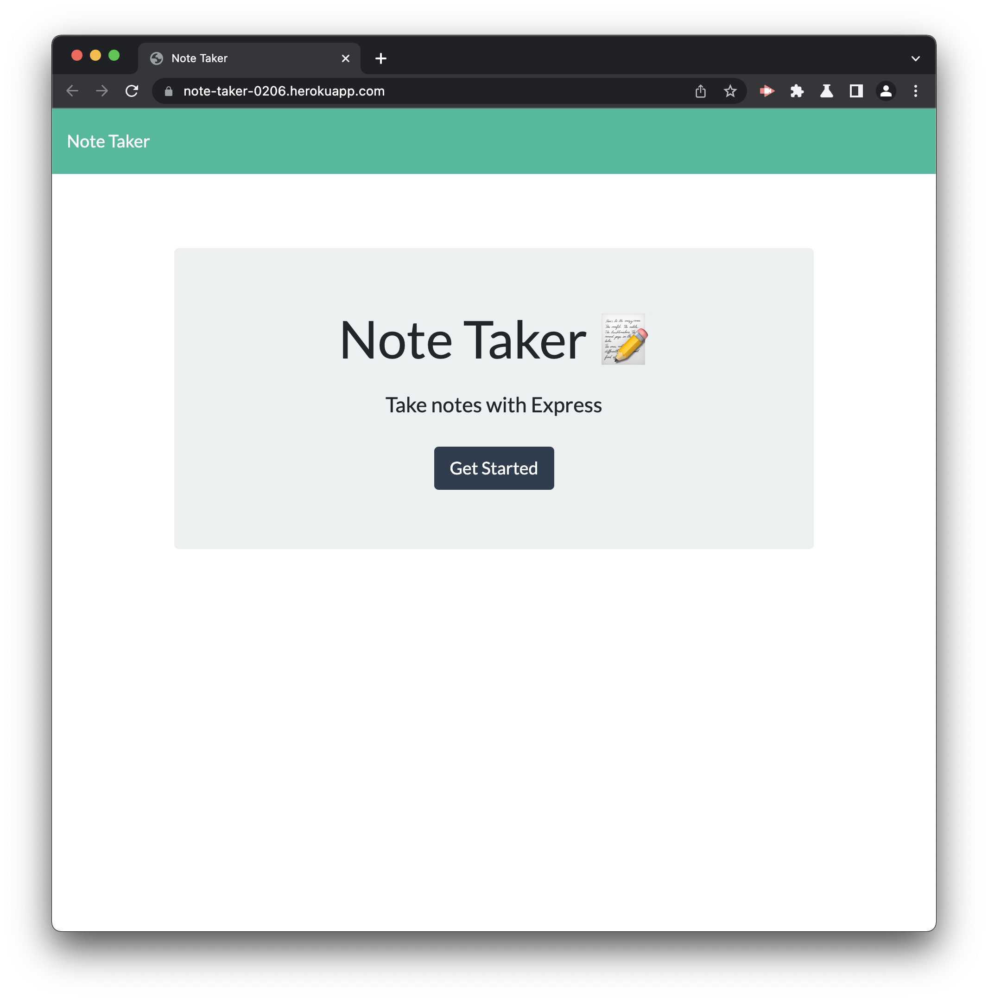

# Note Taker

## Deployment Link

[Deployment](https://note-taker-0206.herokuapp.com/) Click here!

## Description

An application that can be used to write and save notes. Note Taker uses an Express.js back end and saves and retrieves note data from a JSON file.

## Table of Contents

- [Note Taker](#note-taker)
  - [Deployment Link](#deployment-link)
  - [Description](#description)
  - [Table of Contents](#table-of-contents)
  - [Installation](#installation)
  - [Usage](#usage)
  - [Contributing](#contributing)
  - [Tests](#tests)
  - [Questions](#questions)
    - [GitHub](#github)
    - [Email](#email)
  - [Badges](#badges)
  - [License](#license)

<small><i><a href='http://ecotrust-canada.github.io/markdown-toc/'>Table of contents generated with markdown-toc</a></i></small>

## Installation

N/A

## Usage

To begin press the "Get Started" button.

Next, type your note in "Note Text" and give it a title in "Note Title."

Press the floppy disk icon in the right-hand corner of the screen to save the note.

To delete the note press the trash can icon on the right-hand side of it.

## Questions

If you have any additional questions, you can reach me at:

### GitHub

[jesterb0206](https://www.github.com/jesterb0206)

### Email

bradleyjester0@gmail.com

## Badges

## License

[This application is under the MIT license](https://opensource.org/licenses/MIT)
